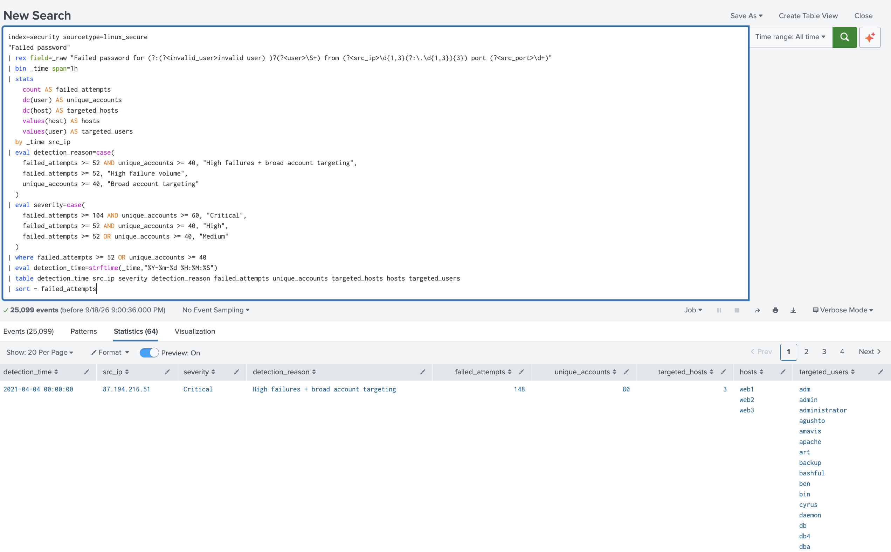
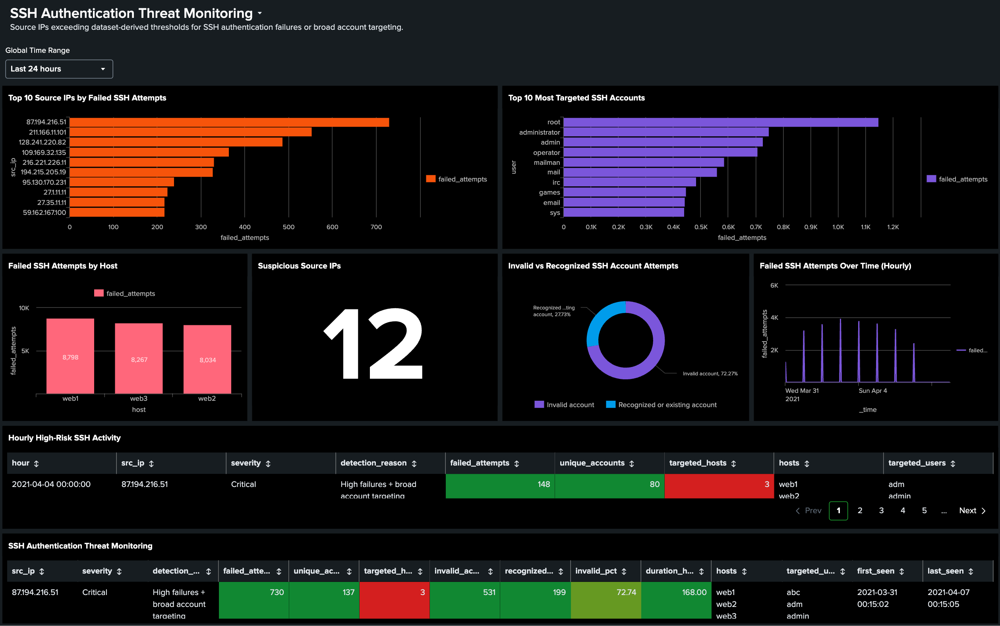
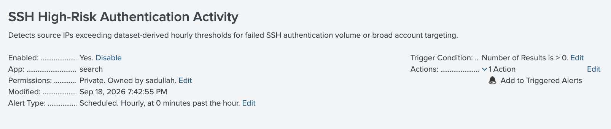

# SSH Authentication Threat Monitoring with Splunk

## Overview

This project demonstrates a hands-on SOC investigation and detection engineering workflow using Splunk.

Linux SSH authentication logs were analyzed to identify high-volume authentication failures, broad account targeting, suspicious source IP behavior, and potential failed-to-successful authentication sequences.

The investigation progressed from raw log analysis and field extraction to behavioral baselining, detection development, dashboard visualization, and scheduled alerting.

> **Project Type:** Hands-on SOC / Splunk Lab  
> **Platform:** Splunk Enterprise  
> **Data Source:** Linux SSH authentication logs  
> **Sourcetype:** `linux_secure`

---

## Investigation Objectives

The investigation focused on:

- Identifying failed SSH authentication activity
- Extracting usernames, source IPs, source ports, and authentication results
- Profiling source IP behavior
- Identifying broad account-targeting activity
- Comparing invalid and recognized account attempts
- Establishing data-driven behavioral baselines
- Correlating failed and successful authentication events
- Developing an hourly SSH detection
- Building a SOC monitoring dashboard
- Creating a scheduled Splunk alert

---

## Dataset Summary

The analyzed dataset contained:

| Metric | Result |
|---|---:|
| Failed SSH authentication attempts | 25,099 |
| Unique source IPs | 185 |
| Monitored hosts | 3 |
| All-time median failures per source IP | 124 |
| All-time P95 failures per source IP | ~218 |
| Hourly P95 failures per source IP | ~51.2 |
| Hourly P95 unique accounts targeted | ~39.22 |

The monitored systems were `web1`, `web2`, and `web3`.

---

## Investigation Findings

The highest-volume source IP observed in the dataset was:

`87.194.216.51`

It generated:

- **730** failed SSH authentication attempts
- **137** unique targeted accounts
- Activity against **3 monitored hosts**
- **531** attempts involving usernames marked as invalid by the SSH logs
- **199** attempts involving usernames not marked as invalid
- Approximately **72.74%** invalid-account targeting

The activity persisted across approximately **168 hours**.

This behavior is consistent with automated SSH credential-guessing and account-enumeration activity. The available authentication telemetry alone is not sufficient to confirm successful unauthorized access.

---

## Failed-to-Successful Authentication Correlation

A correlation search was performed to identify situations where the same:

`source IP + username + host`

generated failed authentication attempts followed by a successful authentication.

Under the defined correlation conditions, **no matching failed-to-successful sequence was identified**.

This result does not prove that no compromise occurred. Additional endpoint, network, and threat-intelligence telemetry would be required for a broader compromise assessment.

---

## Detection Engineering

An hourly baseline was created using source-IP authentication behavior.

The observed 95th-percentile values were approximately:

- **51.2 failed attempts per source IP per hour**
- **39.22 unique accounts targeted per source IP per hour**

For the lab detection, these values were rounded to:

```text
failed_attempts >= 52
OR
unique_accounts >= 40
```

The detection assigns a reason and severity to activity exceeding these thresholds.

The `Critical` classification uses additional lab tuning thresholds and should not be interpreted as a universally applicable production threshold.

---

### Detection Results

The final hourly detection identified **64 source-IP/hour observations** exceeding the dataset-derived thresholds.

The example below shows a Critical detection involving **148 failed authentication attempts**, **80 unique targeted accounts**, and activity across all **3 monitored hosts**.



---
## Final Detection Logic

```spl
index=security sourcetype=linux_secure
"Failed password"
| rex field=_raw "Failed password for (?:(?<invalid_user>invalid user) )?(?<user>\S+) from (?<src_ip>\d{1,3}(?:\.\d{1,3}){3}) port (?<src_port>\d+)"
| bin _time span=1h
| stats
    count AS failed_attempts
    dc(user) AS unique_accounts
    dc(host) AS targeted_hosts
    values(host) AS hosts
    values(user) AS targeted_users
  by _time src_ip
| eval detection_reason=case(
    failed_attempts >= 52 AND unique_accounts >= 40, "High failures + broad account targeting",
    failed_attempts >= 52, "High failure volume",
    unique_accounts >= 40, "Broad account targeting"
  )
| eval severity=case(
    failed_attempts >= 104 AND unique_accounts >= 60, "Critical",
    failed_attempts >= 52 AND unique_accounts >= 40, "High",
    failed_attempts >= 52 OR unique_accounts >= 40, "Medium"
  )
| where failed_attempts >= 52 OR unique_accounts >= 40
| eval detection_time=strftime(_time,"%Y-%m-%d %H:%M:%S")
| table detection_time src_ip severity detection_reason failed_attempts unique_accounts targeted_hosts hosts targeted_users
| sort - failed_attempts
```

The final detection produced **64 source-IP/hour detection results** within the analyzed dataset.

---

## Splunk Dashboard

A monitoring dashboard was developed to support SOC investigation and triage.

The dashboard includes:

- Top source IPs by failed SSH attempts
- Most targeted SSH accounts
- Failed SSH attempts by host
- Suspicious source IP count
- Invalid vs. recognized account attempts
- Failed SSH authentication activity over time
- Hourly high-risk SSH activity
- Detailed suspicious source IP investigation results

### Dashboard Overview

The final dashboard provides a consolidated view of SSH authentication activity, suspicious source IP behavior, account targeting, host distribution, and hourly high-risk detections.



---

## Alerting

The final detection was configured as a scheduled Splunk alert.

**Schedule:** Hourly  
**Trigger condition:** Number of results > 0  
**Action:** Add to Triggered Alerts

A delayed search window was used to account for potential ingestion latency.

### Scheduled Alert Configuration

The detection was operationalized as an enabled hourly Splunk alert.

The alert triggers when the scheduled search returns one or more results and adds the detection to Splunk's Triggered Alerts for analyst review.


---

## SOC Analyst Response

If this detection triggered in a production environment, additional investigation would include:

1. Enriching suspicious source IPs using approved threat-intelligence and OSINT sources.
2. Searching the source IPs across additional security telemetry.
3. Reviewing successful SSH authentication events involving the same infrastructure.
4. Investigating endpoint activity following any suspicious successful login.
5. Determining whether targeted accounts are privileged, administrative, service, or expected accounts.
6. Checking whether the source belongs to approved scanners, vendors, VPN infrastructure, or other authorized systems.
7. Considering blocking or rate-limiting controls with the appropriate security and infrastructure teams.

---

## Skills Demonstrated

- Splunk Search Processing Language (SPL)
- Linux authentication log analysis
- Regular-expression field extraction with `rex`
- Statistical analysis with `stats`
- Distinct counting with `dc()`
- Behavioral baselining and percentile analysis
- Authentication-event correlation
- Detection engineering
- Severity classification
- Splunk dashboard development
- Scheduled alert configuration
- SOC investigation methodology
- Security-event documentation

---

## Project Structure

```text
splunk-ssh-threat-monitoring/
│
├── README.md
│
├── spl/
│   ├── 01-data-assessment.spl
│   ├── 02-failed-authentication-analysis.spl
│   ├── 03-baseline-analysis.spl
│   ├── 04-failed-success-correlation.spl
│   ├── 05-hourly-baseline.spl
│   └── 06-high-risk-ssh-detection.spl
│
├── screenshots/
│   ├── dashboard.png
│   ├── hourly-detection.png
│   └── alert-configuration.png
│
└── docs/
    └── investigation-findings.md
```

### Additional Documentation

For the complete investigation methodology, findings, analyst assessment, and recommended SOC response:

[View the full investigation report](docs/investigation-findings.md)

The SPL searches, dashboard screenshots, detection results, alert configuration, and investigation documentation are organized within these directories.
---

## Disclaimer

This is a hands-on cybersecurity lab project created for educational and portfolio purposes. It does not represent production SOC experience or activity performed against a real organization.

Detection thresholds were derived from the analyzed lab dataset and would require validation and tuning before use in a production environment.
